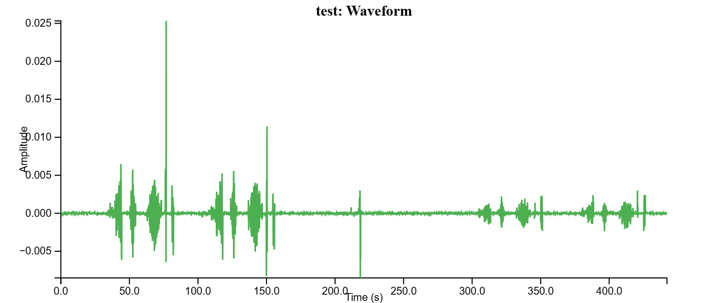
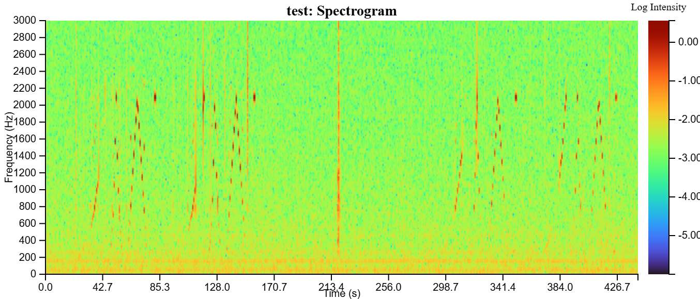

# BickGraphing

[](https://svelte.dev)
[](https://www.typescriptlang.org/)
[](https://doi.org/10.5281/zenodo.19381867)
[](https://arxiv.org/abs/2601.17014)
[](LICENSE)

**Browser-based audio visualization tool** for rapid inspection of `.wav` recordings. Drag-and-drop waveforms and spectrograms, runs entirely client-side, no server, no uploads.

[Open the live demo](https://bicklabuw.github.io/BickGraphing/) · [Try the graphing tool](https://bicklabuw.github.io/BickGraphing/graphing) · [Read the FAQ](https://bicklabuw.github.io/BickGraphing/faq) · [Run the benchmark](https://bicklabuw.github.io/BickGraphing/benchmark)

## Contents

- [Features](#features)
- [Background](#background)
- [Usage](#usage)
- [Expected Output](#expected-output)
- [Architecture](#architecture)
- [Tech Stack](#tech-stack)
- [Dependencies](#dependencies)
- [Local Setup](#local-setup)
- [Testing & Validation](#testing--validation)
- [Deployment](#deployment)
- [Citation](#citation)

## Features

- **Multi-file uploads** with a reorderable file list and click-to-scroll mini-waveform thumbnails.
- **Per-file controls.** Each file has its own Show Details, Show Sliders, Reset, and Download menu.
- **Dual visualization.** Synchronized waveform (D3 line plot) and spectrogram (canvas heatmap with the Turbo colormap) over the same time window.
- **Interactive sliders** for amplitude, frequency, and time, with file-aware validation that warns when an end time exceeds individual file durations.
- **Hours-long audio support** with web-worker parallel STFT for long files.
- **Export** as SVG, PNG, or JPEG straight from the panel.
- **Offline first, no persistent storage.** Nothing is uploaded; nothing is saved to localStorage or cookies.

## Background

Built for **insect bioacoustics research**, originally to support rapid quality checks on field recordings collected by the [Insect Eavesdropper](https://www.insecteavesdropper.com/home) project. The audience is non-technical users (farmers, field techs, students) who need instant visual feedback on `.wav` files without writing any code.

Design constraints:

- Works offline in the field, no internet required.
- Handles hours-long recordings on consumer hardware (~500 MB peak memory on typical fixtures).
- Drag, adjust sliders, export. No CLI, no setup.

## Usage

1. Open the [live graphing tool](https://bicklabuw.github.io/BickGraphing/graphing) or run locally with `npm run dev`.
2. Drag and drop one or more `.wav` files into the browser window.
3. Pick a visualization (**Waveform**, **Spectrogram**, or both) via the View Selector at the top.
4. Inside each file's panel:
   - **Show/Hide Details** toggles rendering metadata.
   - **Show/Hide Sliders** reveals interactive controls (amplitude/frequency, time, numeric inputs, Reset).
   - **Download** exports the panel as SVG, PNG, or JPEG.
5. The global Time/Amplitude/Frequency inputs at the top apply across all files at once, with validation: invalid values are blocked with a red alert; end times that exceed at least one file's duration trigger an amber soft warning.
6. Click a mini-waveform thumbnail along the top row to smoothly scroll to that file's panel.

For design rationale, supported formats, and citation guidance, see the [FAQ page](https://bicklabuw.github.io/BickGraphing/faq). For per-machine STFT timing benchmarks across audio lengths and signal types (sine, siren, noise), see the [benchmark page](https://bicklabuw.github.io/BickGraphing/benchmark).

## Expected Output

After loading [`tests/fixtures/test.wav`](tests/fixtures/test.wav):

**Waveform view.** ~442 seconds plotted as amplitude over time, y-axis range roughly -0.01 to 0.016, with a "Waveform Ready" status pill in the top-left of the panel.



**Spectrogram view.** Frequency content from 0 to 3 kHz by default (extendable up to 22050 Hz, the Nyquist limit for 44.1 kHz audio), Turbo colormap (blue = low energy, red = high energy), with a "Spectrogram Ready" status pill in the top-left.



The 3 kHz default targets the primary band for insect vibrational signals captured by the Insect Eavesdropper sensor. Content above 22050 Hz is either absent or a resampling artifact, so the slider is hard-capped at that ceiling.

For additional reference fixtures (pure tone, sweep, siren, musical scale, layered harmonics) rendered side-by-side, see [`tests/outputs/README.md`](tests/outputs/README.md).

## Architecture

```
┌─ Routes              src/routes/
│                      ├─ +page.svelte           (landing)
│                      ├─ graphing/+page.svelte  (main tool)
│                      ├─ faq/+page.svelte       (FAQ)
│                      └─ benchmark/+page.svelte (STFT benchmark)
│
├─ File I/O            src/lib/components/
│                      ├─ fileselector.svelte    (drag-and-drop input)
│                      └─ filelist.svelte        (reorderable file list)
│
├─ Signal Processing   ├─ FFmpeg.wasm                       (WAV decode)
│                      ├─ src/lib/utils/fft.ts              (radix-2 FFT)
│                      ├─ src/lib/utils/wavHeader.ts        (duration peek for long files)
│                      ├─ src/lib/utils/waveformData.ts     (decimation for the line plot)
│                      └─ src/lib/workers/stft.worker.ts    (parallel STFT pool)
│
├─ Visualization       src/lib/components/
│                      ├─ graph.svelte           (orchestrator)
│                      ├─ waveform.svelte        (D3 line plot)
│                      ├─ spectrogram.svelte     (canvas heatmap)
│                      └─ miniwaveform.svelte    (top-row thumbnail)
│
└─ Controls            src/lib/components/
                       ├─ rangeslider.svelte     (noUiSlider wrapper)
                       ├─ rangeinput.svelte      (validated min/max number pair)
                       ├─ viewselector.svelte    (waveform/spectrogram toggle)
                       └─ togglebutton.svelte    (Show/Hide button)
```

The STFT uses a 2048-sample FFT with a 1024-sample hop and a Hann window, matching the parameters validated against `librosa` in the test suite.

## Tech Stack

| Layer     | Tech                                           |
| --------- | ---------------------------------------------- |
| Framework | SvelteKit 2.16+, TypeScript 5, Vite 6          |
| Audio     | FFmpeg.wasm 0.12, Web Audio API, web workers   |
| Viz       | D3.js 7.9 (scales/axes/line), Canvas2D heatmap |
| Styling   | TailwindCSS 3.4, PostCSS, autoprefixer         |
| Controls  | noUiSlider 15.8, svelte-dnd-action 0.9         |
| Testing   | Vitest, librosa (Python, fixture parity)       |

**Bundle:** roughly 30 MB (FFmpeg plus dependencies), loads in under 5 seconds on modern browsers.

## Dependencies

Runtime dependencies are listed in the Tech Stack table above. Build and dev tooling adds ESLint 9, Prettier 3.4 (with `prettier-plugin-svelte` and `prettier-plugin-tailwindcss`), `svelte-check`, `gh-pages`, and `cross-env`. See [`package.json`](package.json) for the complete list with exact version ranges.

## Local Setup

These instructions are written for Ubuntu; the same `npm` commands work on macOS and Windows once Node 20+ is on `PATH`.

```bash
# Install Node 20 (Ubuntu)
curl -fsSL https://deb.nodesource.com/setup_20.x | sudo -E bash -
sudo apt install -y nodejs

# Install project dependencies
npm install

# Run the dev server (with auto-open in a new tab)
npm run dev -- --open
```

To produce a production build:

```bash
npm run build
npm run preview   # optional local preview of the production build
```

## Testing & Validation

The signal-processing pipeline is covered by a Vitest suite that includes unit tests on the Hann window, integration tests on the composed STFT, and characterization tests that compare our output bin-for-bin against [librosa](https://librosa.org/) as a reference implementation.

```bash
npm test
```

Python fixtures (committed under [`tests/fixtures/`](tests/fixtures/)) only need to be regenerated if you change test parameters:

```bash
pip install -r tests/requirements.txt
npm run test:fixtures
```

For full documentation, including test categories, librosa parameters, and instructions for extending the suite, see [`tests/README.md`](tests/README.md).

## Deployment

BickGraphing is hosted on **GitHub Pages** at <https://bicklabuw.github.io/BickGraphing/>. Deploy with:

```bash
npm run deploy
```

This runs `cross-env GITHUB_PAGES=true npm run build` (which bakes the `/BickGraphing` base path into asset URLs via `svelte.config.js`) and then `npx gh-pages -d build` to push the static build to the `gh-pages` branch.

GitHub Pages does not natively support client-side routing, so the build emits `build/404.html` (configured via `fallback: '404.html'` in `svelte.config.js`). Pages serves this file for any unknown route, and the SvelteKit shell inside it takes over and renders the correct page client-side.

Version 0.1.0 is preserved at <https://ie-graphing-709865.pages.doit.wisc.edu> on UW–Madison's GitLab Pages for archival purposes.

## Citation

If you use BickGraphing in your research, please cite our preprint:

> Seow, K., Arovas, A., Steinmetz, G., & Bick, E. (2026). _BickGraphing: Web-Based Application for Visual Inspection of Audio Recordings_. arXiv:2601.17014 [eess.AS]. https://arxiv.org/abs/2601.17014

**BibTeX:**

```bibtex
@misc{seow2026bickgraphing,
  title         = {BickGraphing: Web-Based Application for Visual Inspection of Audio Recordings},
  author        = {Seow, Kayley and Arovas, Alexander and Steinmetz, Grace and Bick, Emily},
  year          = {2026},
  eprint        = {2601.17014},
  archivePrefix = {arXiv},
  primaryClass  = {eess.AS},
  url           = {https://arxiv.org/abs/2601.17014}
}
```

For citing a specific software release, see [`CITATION.cff`](CITATION.cff) or use the Zenodo DOI badge above.
