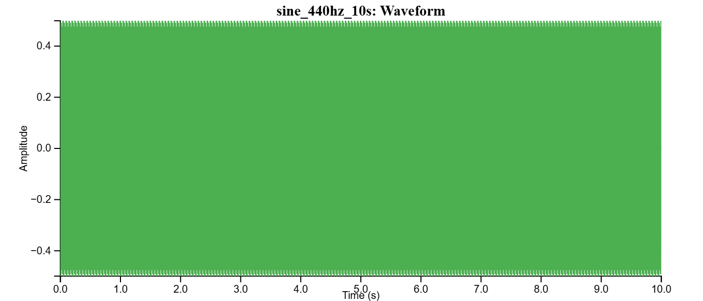
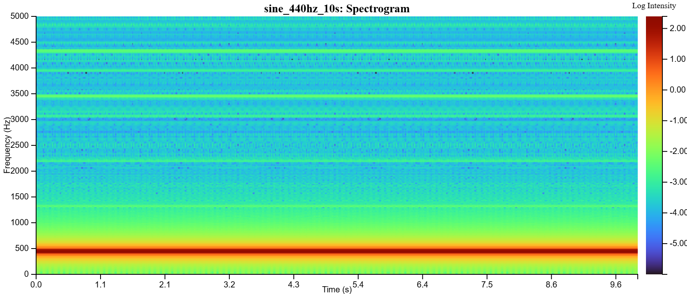
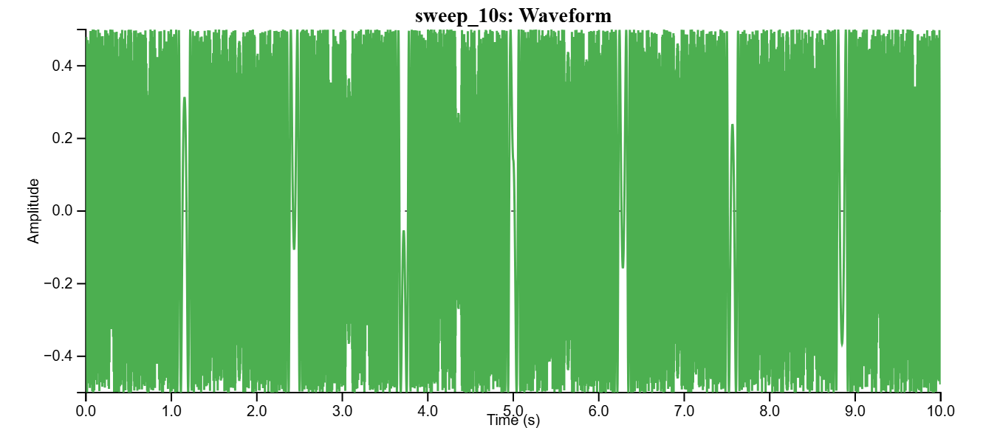
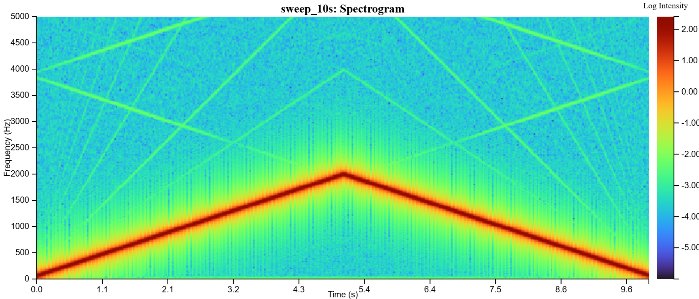
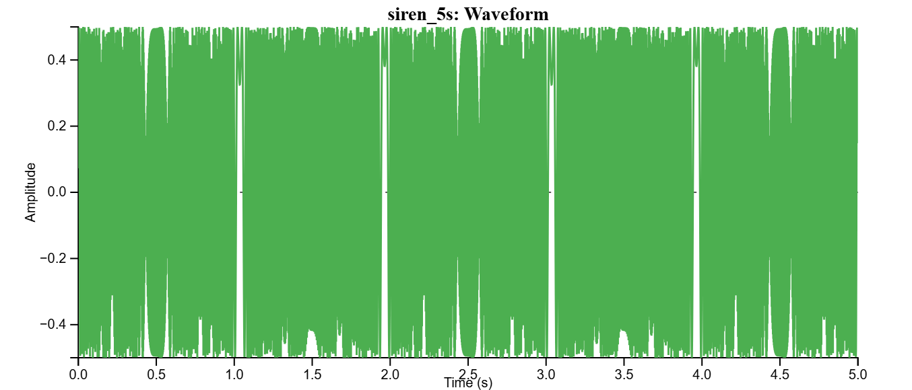
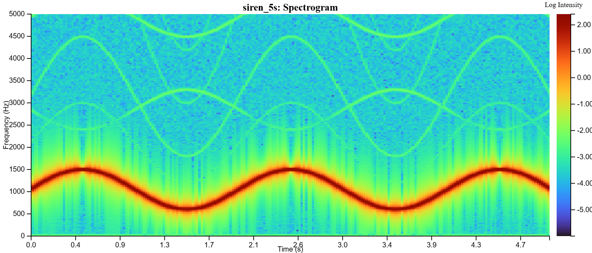
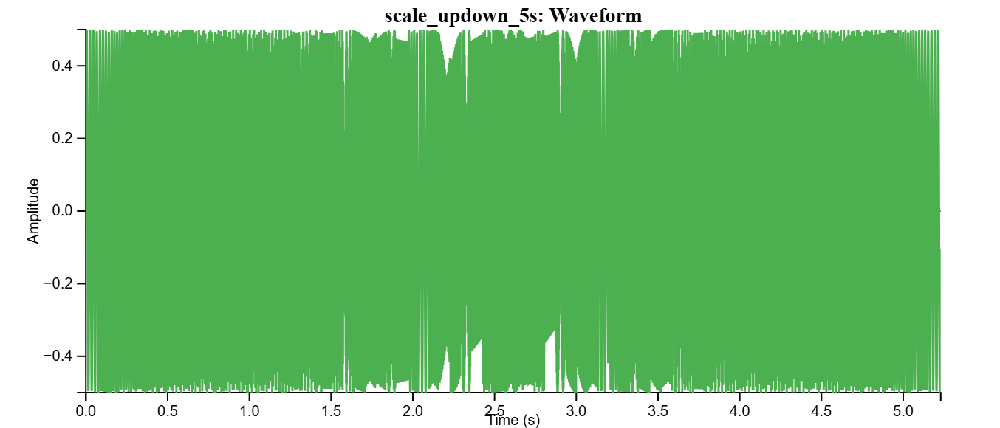
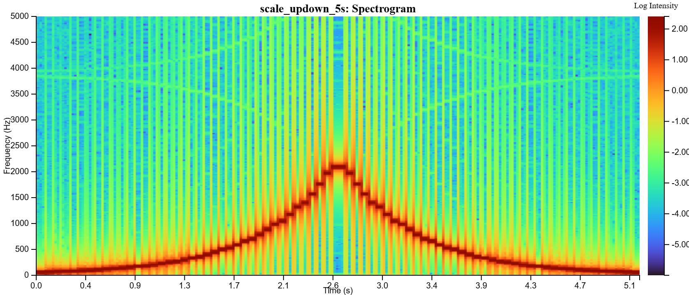
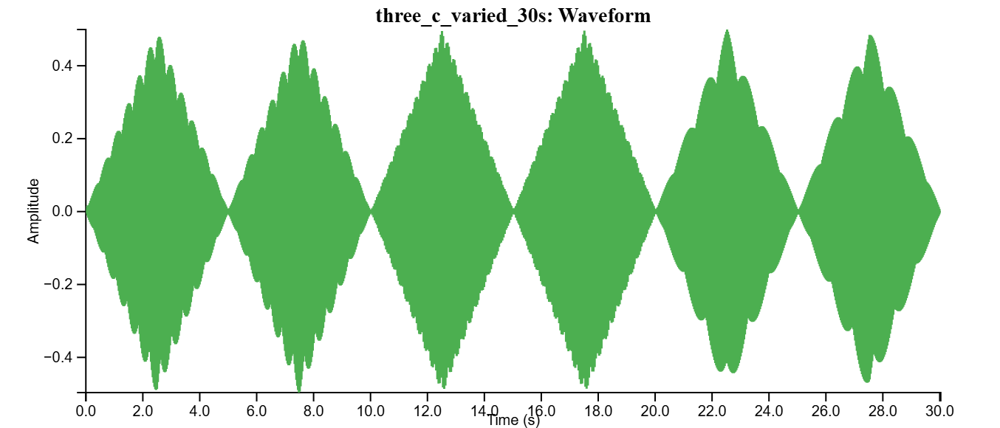
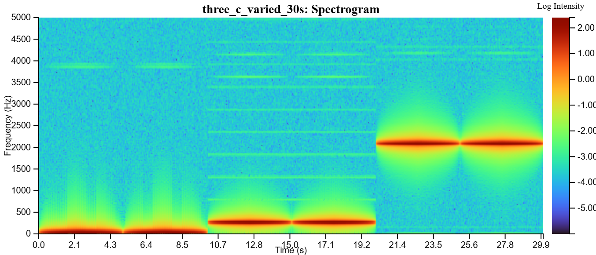

# Showcase outputs

A visual reference of what the app produces for a hand-picked set of fixtures.
Each row links to the source WAV and shows the waveform + spectrogram as
rendered by the app's built-in PNG export.

| File | Waveform | Spectrogram | What you're looking at |
|------|----------|-------------|------------------------|
| [`test.wav`](../fixtures/test.wav) |  |  | Multi-signal composite from `CreateWavSounds.py`; the integration-test workhorse. |
| [`sine_440hz_10s.wav`](../fixtures/10_second_files/sine_440hz_10s.wav) |  |  | Pure 440 Hz tone, the simplest possible spectrogram (one flat horizontal line). |
| [`sweep_10s.wav`](../fixtures/10_second_files/sweep_10s.wav) |  |  | Linear frequency sweep, the iconic diagonal climb. |
| [`siren_5s.wav`](../fixtures/misc_wav_files/siren_5s.wav) |  |  | FM siren, a sinusoidal ribbon as pitch oscillates around a center. |
| [`scale_updown_5s.wav`](../fixtures/misc_wav_files/scale_updown_5s.wav) |  |  | Discrete musical pitches stepping up then down, producing a staircase pattern. |
| [`three_c_varied_30s.wav`](../fixtures/misc_wav_files/three_c_varied_30s.wav) |  |  | Three octaves of C at varied volume, showing stacked harmonics with amplitude shifts. |

## Reproducing these images

Both the waveform and the spectrogram can be exported in three formats:
**SVG** (vector, ideal for figures and zooming without quality loss), **PNG**
(lossless raster, what's used in the table above), and **JPEG** (smaller file
size, good for sharing). Pick the format from the Download dropdown on either
panel.

1. Open the deployed app at <https://bicklabuw.github.io/BickGraphing/graphing>, or run it locally with `npm run dev`
2. Upload one of the WAVs above
3. Make sure both waveform and spectrogram views are on
4. Use the Download dropdown on each panel → **SVG**, **PNG**, or **JPEG**
5. The app auto-names exports with the visible time/frequency window, so the filenames here embed the exact zoom state used.
